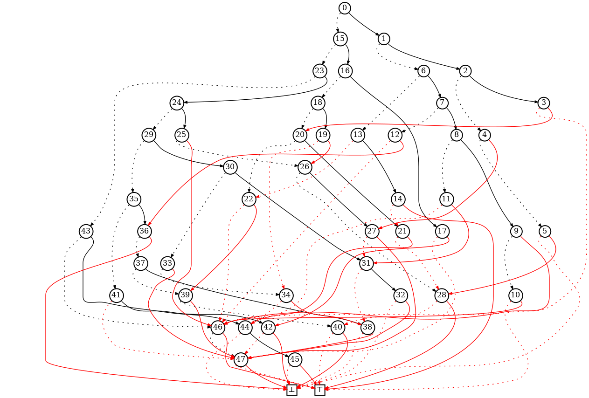

# BDDgen

BDD generator
(C) J. Clément and A. Genitrini under the GNU Public license v.3 (cf. LICENSE.txt)

BDDgen is an unranking algorithm for Reduced Ordered Binary Decision Diagrams (ROBDDs) of a given size and a given number of variables. The tool is based on the classical recursive method of Nijenhuis and Wilf, but the ROBDDs are not decomposable in their sense. Thus an extra set of structures called multientry-BDDs must first be counted before the generation step.
The algorithm is based on the paper Combinatorics of Reduced Ordered Binary Decision Diagrams: Application to uniform random sampling (from J. Clément and A. Genitrini).

----


----

The internal representation of a ROBDD in our program is obtained through a double postorder followed by a inorder traversal. Each level is associated with a specific Boolean variable. Thus this ROBDD depends on 12 variables (and is of size 50).

----

The python code can be interpreted with pypy3 to be more efficient (but python3 interprter is good also).

In order to compute the distibution of the Boolean functions in 8 variables according to their ROBDD size, we call :

```
pypy3 bdd_func_minimal.py 8
```

With a personal computer to compute the distribution for 12 variables we will need a couple of hours.

In order to sample uniformly at random a ROBDD in 12 variables and with size 50, we call:

```
pypy3 bdd_unrank.py 50 12
```

We can directly redirect the output in a .dot file in order to print it with graphviz (see the tests_dot directory).
